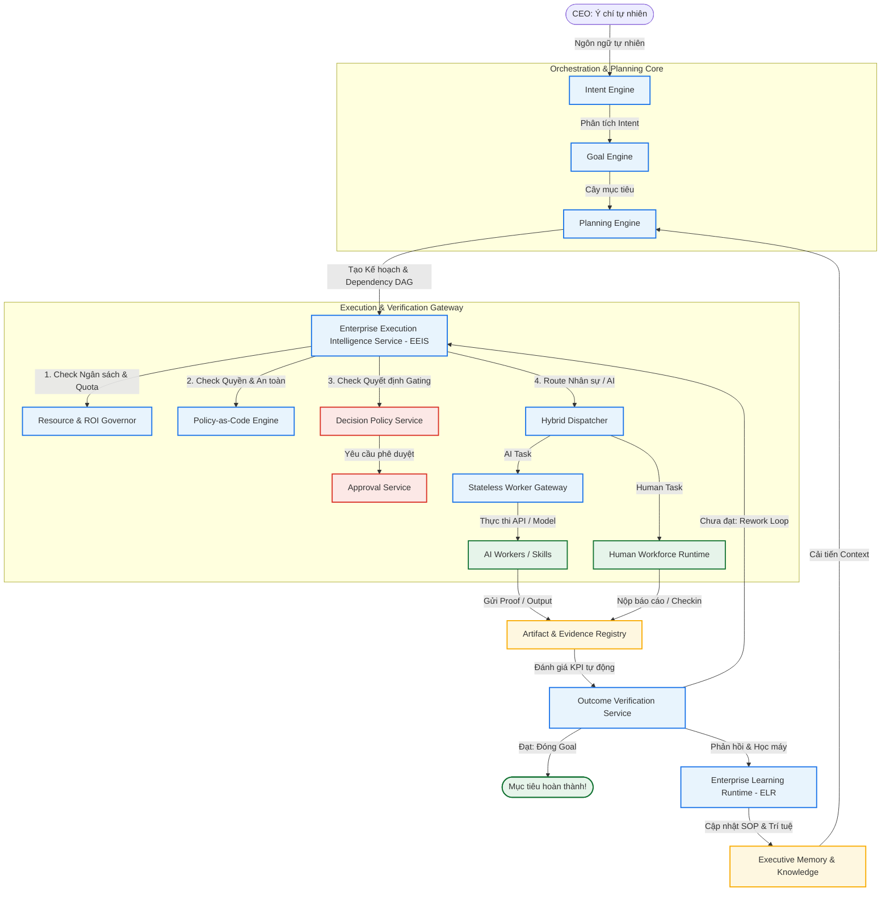

# 🏛️ BELLA OPERATING SYSTEM (BELLA EOS): WORKFLOW ENGINE ARCHITECTURE
> **TÀI LIỆU KỸ THUẬT DÀNH CHO NHÀ ĐẦU TƯ (TECHNICAL SPECIFICATION FOR INVESTORS)**  
> **PHIÊN BẢN**: `v21.0`  
> **TRẠNG THÁI**: `PHÊ DUYỆT & ĐÓNG BĂNG KIẾN TRÚC`  
> **MÃ HÓA NỘI BỘ**: `EEIS-ECOS-ORCHESTRATION`

---

## 1. 🎯 TẦM NHÌN CHIẾN LƯỢC: WORKFLOW ENGINE LÀ COO CỦA DOANH NGHIỆP
Bella EOS không chỉ là một công cụ chat AI, mà là một **Hệ điều hành doanh nghiệp thực thi tự động (System of Execution)**. Trong đó, hệ thống Workflow Engine đóng vai trò như một **COO (Giám đốc Vận hành số)**:
- **Tự động hóa từ Ý định (Intent) đến Kết quả (Outcome)**: CEO chỉ cần nhập mục tiêu bằng ngôn ngữ tự nhiên.
- **Tối ưu hóa nguồn lực hỗn hợp (Hybrid Workforce)**: Điều phối công việc thông minh giữa AI Workers và Nhân sự thực tế (Human Runtime).
- **Tuân thủ chính sách tuyệt đối (Policy-as-Code)**: Tích hợp chéo với các rào chắn về luật, ngân sách tài chính và độ an toàn trước khi hành động.

---

## 2. 🗺️ SƠ ĐỒ ĐIỀU PHỐI WORKFLOW TỔNG THỂ (END-TO-END PIPELINE)

Hệ thống phân tách rạch ròi giữa **Nhận thức (Cognition)**, **Lên kế hoạch (Planning)**, **Thực thi (Execution)**, và **Đánh giá kết quả (Verification)**:



---

## 3. 📂 BẢN ĐỒ CÁC FILE CHỨA LUỒNG VẬN HÀNH CHÍNH (SOURCE CODE MAPPING)

Tất cả logic nghiệp vụ cốt lõi điều phối và thực thi workflow trong Bella EOS được phân bố theo các file cấu trúc cụ thể:

### 3.1 Nhóm Phân tích Ý định & Lập kế hoạch (Orchestration Engine)
Nhóm file chịu trách nhiệm tiếp nhận chỉ thị đầu vào, bẻ nhỏ mục tiêu và sinh sơ đồ phụ thuộc công việc (DAG):
- 📁 **Thư mục:** [`src/core/orchestration/`](file:///d:/Antigravity/Projects/DN%20WORKFLOW/src/core/orchestration/)
- **Các file nghiệp vụ cốt lõi:**
  1. [`intent-engine.ts`](file:///d:/Antigravity/Projects/DN%20WORKFLOW/src/core/orchestration/intent-engine.ts): Phân tích câu lệnh ngôn ngữ tự nhiên của CEO (Intent Parsing) thành cấu trúc máy hiểu được.
  2. [`goal-engine.ts`](file:///d:/Antigravity/Projects/DN%20WORKFLOW/src/core/orchestration/goal-engine.ts): Bẻ mục tiêu thành cây mục tiêu (`Vision ➔ Goal ➔ Outcome`).
  3. [`planning-engine.ts`](file:///d:/Antigravity/Projects/DN%20WORKFLOW/src/core/orchestration/planning-engine.ts): Sinh kế hoạch gồm các Tasks, định hình luồng xử lý và thứ tự thực thi.
  4. [`orchestration.ts`](file:///d:/Antigravity/Projects/DN%20WORKFLOW/src/core/orchestration/orchestration.ts): Master controller kích hoạt toàn bộ chu trình lập kế hoạch và phản hồi lên hệ thống.

### 3.2 Nhóm Thực thi Thông minh (Execution Runtimes)
Đảm nhận việc điều phối, chạy các task theo mô hình đồ thị có hướng (DAG), phân luồng phân việc và thu thập tài liệu bàn giao (deliverables):
- 📁 **Thư mục:** [`src/core/execution/`](file:///d:/Antigravity/Projects/DN%20WORKFLOW/src/core/execution/)
- **Các file nghiệp vụ cốt lõi:**
  1. [`enterprise-execution-intelligence-service.ts`](file:///d:/Antigravity/Projects/DN%20WORKFLOW/src/core/execution/enterprise-execution-intelligence-service.ts) (EEIS): **Trái tim thực thi của hệ điều hành**. Quản lý vòng đời deliverable, xử lý task bị block, lập cấu trúc nhóm song song, ghi nhận lịch sử Rework (làm lại) và tính toán KPI tự động.
  2. [`stateless-worker-gateway.ts`](file:///d:/Antigravity/Projects/DN%20WORKFLOW/src/core/execution/stateless-worker-gateway.ts): Gateway trung chuyển gọi các Worker AI bên ngoài độc lập không lưu trạng thái (Stateless Workers).
  3. [`capability-registry.ts`](file:///d:/Antigravity/Projects/DN%20WORKFLOW/src/core/execution/capability-registry.ts): Đăng ký và quản lý phiên bản của năng lực AI (Ví dụ: `Reasoning`, `Copywriting`), giúp điều hướng yêu cầu đến đúng Model AI tối ưu chi phí nhất.
  4. [`campaign-manager.ts`](file:///d:/Antigravity/Projects/DN%20WORKFLOW/src/core/execution/campaign-manager.ts): Quản lý vòng đời các chiến dịch quảng cáo và tiếp thị liên quan đến mục tiêu doanh nghiệp.

### 3.3 Nhóm Trọng tài Chính sách & Phê duyệt (Governance & Policy Guardrails)
Đảm bảo an toàn vận hành, phân cấp quyền duyệt giữa CEO, Quản lý cấp trung và chạy tự động (AI Auto-run):
- 📁 **Thư mục:** [`src/core/infrastructure/`](file:///d:/Antigravity/Projects/DN%20WORKFLOW/src/core/infrastructure/) & [`src/governance/`](file:///d:/Antigravity/Projects/DN%20WORKFLOW/src/governance/)
- **Các file nghiệp vụ cốt lõi:**
  1. [`decision-policy-service.ts`](file:///d:/Antigravity/Projects/DN%20WORKFLOW/src/core/infrastructure/decision-policy-service.ts): Trọng tài phân cấp quyết định. Đánh giá rủi ro tài chính / vận hành để đưa ra chế độ: `AI_AUTO_EXECUTE`, `MANAGER_APPROVAL`, `CEO_APPROVAL`, hoặc `REJECT`.
  2. [`approval-service.ts`](file:///d:/Antigravity/Projects/DN%20WORKFLOW/src/core/infrastructure/approval-service.ts): Quản lý quy trình phê duyệt nhiều cấp (song song, tuần tự hoặc có điều kiện).
  3. [`src/governance/policy-runtime.ts`](file:///d:/Antigravity/Projects/DN%20WORKFLOW/src/governance/policy-runtime.ts) & [`src/core/gov/policy-as-code-service.ts`](file:///d:/Antigravity/Projects/DN%20WORKFLOW/src/core/gov/policy-as-code-service.ts): Thực thi kiểm tra bảo mật, phân quyền tài nguyên hệ thống dựa trên chính sách viết dưới dạng code (Policy-as-Code).

### 3.4 Nhóm Đánh giá & Học máy Cải tiến SOP (Outcome & Learning Flywheel)
Phục vụ chu trình khép kín: Đo lường chất lượng, lưu giữ kinh nghiệm tốt và cập nhật SOP tự động:
- 📁 **Thư mục:** [`src/core/elr/`](file:///d:/Antigravity/Projects/DN%20WORKFLOW/src/core/elr/)
- **Các file nghiệp vụ cốt lõi:**
  1. [`outcome-verification-service.ts`](file:///d:/Antigravity/Projects/DN%20WORKFLOW/src/core/infrastructure/outcome-verification-service.ts): So khớp chỉ số đạt được thực tế so với KPI mục tiêu của kế hoạch.
  2. [`knowledge-distillation-runtime.ts`](file:///d:/Antigravity/Projects/DN%20WORKFLOW/src/core/elr/knowledge-distillation-runtime.ts): Trích xuất bài học kinh nghiệm từ các task thất bại hoặc thành công.
  3. [`experience-learning-runtime.ts`](file:///d:/Antigravity/Projects/DN%20WORKFLOW/src/core/elr/experience-learning-runtime.ts): Đánh giá độ lệch giữa dự đoán của AI và hiệu quả thực tế để chấm điểm kinh nghiệm tích lũy của doanh nghiệp.

---

## 4. 💎 3 GIÁ TRỊ CỐT LÕI MANG LẠI LỢI THẾ CẠNH TRANH CHO DOANH NGHIỆP

> [!IMPORTANT]
> **1. KHẢ NĂNG TRUY VẤN NGUỒN GỐC AI (ANSWER TRACEABILITY)**  
> Mọi hành động hoặc câu trả lời của AI đều được gắn kèm tham chiếu đến file tài liệu nguồn (`document_versions.id` đăng ký tại PostgreSQL kết hợp lưu trữ file trên Object Storage). Loại bỏ hoàn toàn lỗi ảo giác (hallucination) của AI thông thường.

> [!TIP]
> **2. TỰ ĐỘNG CHUYỂN PHÒNG BAN & PHÂN LUỒNG LAO ĐỘNG HỖN HỢP**  
> Dựa trên hồ sơ kỹ năng số đăng ký tại [human-registry.ts](file:///d:/Antigravity/Projects/DN%20WORKFLOW/src/core/workforce/human-registry.ts), hệ thống tự tính toán xem công việc đó giao cho AI chạy để giảm giá thành (Token cost cực thấp) hay phải điều chuyển cho con người xử lý để đảm bảo độ chuẩn xác tối đa.

> [!CAUTION]
> **3. CẬP NHẬT TỰ ĐỘNG SOP DOANH NGHIỆP TRONG THỜI GIAN THỰC**  
> Khi một nhân sự con người chỉnh sửa hay thực hiện thành công một task phức tạp, hệ thống tự động sinh ra một Learn Ticket, ghi nhận và đóng gói luồng hành vi đó thành một SOP Skill Pack mới để huấn luyện trực tiếp cho thế hệ Agent tiếp theo mà không cần viết lại code nền tảng.

---

## 5. 🚀 LỘ TRÌNH NÂNG CẤP HỆ THỐNG (UPGRADE ROADMAP)

Để đưa nền tảng đạt cấp độ vận hành quy mô lớn (Enterprise Platform Grade), kiến trúc được định hướng phát triển thêm 4 trụ cột công nghệ sau:

### 5.1 Runtime Reliability (Khả năng tự phục hồi)
Nâng cấp cơ chế xử lý lỗi khi AI Worker hoặc các API dịch vụ bên ngoài gặp sự cố:
```
[Execution Task] ➔ [1. Retry Engine] ➔ [2. Timeout Limit] ➔ [3. Circuit Breaker] ➔ [4. Dead Letter Queue]
```
- **Circuit Breaker**: Tự động ngắt kết nối và kích hoạt kịch bản dự phòng (Fallback) khi phát hiện API của một Model LLM bị gián đoạn liên tục.
- **Dead Letter Queue (DLQ)**: Lưu trữ các task lỗi để quản trị viên kiểm tra và cấu hình lại thủ công mà không làm nghẹt hệ thống chính.

### 5.2 Resource Scheduling (Điều phối tài nguyên thông minh)
Khi số lượng Workflow chạy song song lớn, hệ thống bổ sung bộ lập lịch tài nguyên nâng cao:
```
100+ Concurrent Workflows ➔ [Priority Queue] ➔ [Scheduler] ➔ [Quota Check] ➔ [AI Cost Optimizer]
```
- **Priority Queue**: Ưu tiên điều phối tài nguyên CPU/GPU/Token cho các Workflow của phòng ban chiến lược.
- **AI Cost Optimizer**: Phân tích lịch sử chất lượng để chọn Model rẻ nhất mà vẫn đủ điều kiện hoàn thành mục tiêu (ví dụ: chuyển từ GPT-4o sang Gemini Flash cho tác vụ lọc text đơn giản).

### 5.3 Enterprise Observability (Tháp điều khiển COO Control Tower)
Cung cấp bảng điều hành trung tâm (Realtime dashboard) hiển thị trực quan các lát cắt:
- **Luồng đang vận hành**: Sơ đồ cây mục tiêu thực tế kèm tiến độ động.
- **Điểm nghẽn (Bottlenecks)**: Các task đang bị kẹt hoặc chậm tiến độ so với SLA.
- **Phân tích lỗi**: Bảng thống kê Planner/Worker có tỷ lệ lỗi cao nhất.
- **Phân bổ chi phí**: Chi phí token và điện toán quy ra VNĐ theo phòng ban.

### 5.4 Multi-Agent Coordination (Đồng thuận đa mô hình)
Áp dụng cơ chế bỏ phiếu đồng thuận cho các quyết định tối quan trọng:
```
[Planner Request] ➔ [GPT-4o + Claude 3.5 + Gemini 1.5] ➔ [Consensus Voting] ➔ [Verifier Validation]
```

---

## 6. 🏛️ CÁC MẢNH GHÉP ĐẠT CHUẨN DOANH NGHIỆP LỚN (ENTERPRISE-GRADE CAPABILITIES)

Để đạt điểm tối đa 10/10 về thiết kế hệ điều hành quy mô lớn, Bella EOS tích hợp chặt chẽ 5 kiến trúc nền tảng vận hành sau:

### 6.1 Workflow Persistence (Khả năng tiếp tục sau sự cố)
Hệ thống sử dụng cơ chế lưu vết trạng thái (State Checkpointing) vào cơ sở dữ liệu sau mỗi bước hoàn thành của đồ thị DAG.
```
Step 1: Completed ──► [Write checkpoint to Database]
                              │
                      [Server Crash / Restart]
                              │
Step 2: Resumed   ◄── [Load checkpoint & continue] (Không cần chạy lại Step 1)
```
- **Lợi ích**: Khi hệ thống khởi động lại, công việc sẽ tiếp tục chạy từ bước bị gián đoạn gần nhất dựa trên lịch sử lưu trong bảng `IStateStore` thay vì chạy lại từ đầu gây lãng phí tài nguyên và làm trùng lặp dữ liệu API.

### 6.2 Versioned Workflow (Quản lý phiên bản quy trình vận hành)
Mỗi quy trình làm việc được đóng dấu phiên bản (`version_id`). Khi doanh nghiệp cập nhật quy trình từ V1 lên V2:
- **Nguyên tắc bất biến**: Các quy trình đang chạy dở dang (in-flight) sẽ tiếp tục chạy và kết thúc theo cấu trúc V1.
- **Quy trình mới**: Chỉ các yêu cầu khởi tạo sau thời điểm phát hành V2 mới áp dụng cấu trúc V2.
- **Lợi ích**: Triệt tiêu rủi ro xung đột dữ liệu và phá vỡ cấu trúc DAG nghiệp vụ giữa chừng.

### 6.3 Distributed Execution (Điều phối phân tán đa Tenant)
Khi mở rộng quy mô lên hàng nghìn workflow và hàng trăm AI Workers chạy đồng thời, Bella EOS chuyển dịch sang kiến trúc Message Broker (như RabbitMQ / Kafka) kết hợp các Runner phân tán:
```
[EEIS Brain] ──► Push Task to Message Queue (Routing key: tenant_id.capability)
                        ├──► [Runner Node A] ──► Executes task for Tenant 1
                        └──► [Runner Node B] ──► Executes task for Tenant 2
```
- **Lợi ích**: Phân tán tải điện toán, đảm bảo cách ly tài nguyên giữa các khách hàng doanh nghiệp khác nhau (Multi-Tenancy) và triệt tiêu điểm nghẽn đơn lẻ (Single Point of Failure).

### 6.4 Cost Intelligence (Báo cáo hiệu quả ROI tài chính)
Bella EOS không chỉ quản lý hạn ngạch, mà cung cấp một lớp phân tích tài chính sâu sắc:
- **Cost per Workflow**: Tính tổng chi phí API/token tiêu thụ trên từng mục tiêu (Goal) cụ thể.
- **Cost per Department**: Phân bổ ngân sách sử dụng AI theo phòng ban (Marketing, CS, HR).
- **AI vs Human ROI Index**: So sánh chi phí và thời gian hoàn thành của AI Workers so với nhân sự con người để đề xuất phương án tối ưu hóa lợi nhuận tốt nhất cho COO.

### 6.5 Business Audit Timeline (Dòng thời gian truy vết nghiệp vụ)
Bên cạnh file log kỹ thuật, hệ thống lưu trữ một dòng thời gian nghiệp vụ đơn giản, minh bạch và dễ đọc phục vụ kiểm toán:
```
[09:00] CEO tạo Goal: "Mở rộng chi nhánh Đà Nẵng"
[09:01] Planning Engine phân rã thành 5 nhiệm vụ chính
[09:02] Decision Policy duyệt: "Phê duyệt tự động chạy AI"
[09:05] AI Worker (Ares) hoàn thành viết Landing Page
[09:06] AI Worker (Hermes) tạo thành công Poster thiết kế
[09:08] Nhân sự (Nguyễn Văn A) phê duyệt chất lượng (SOP check)
[09:10] Outcome Verification xác nhận: KPI Leads đạt mục tiêu ➔ Đóng Goal.
```
- **Lợi ích**: Giúp CEO và kiểm toán viên dễ dàng truy vết nguồn gốc quyết định, hiểu rõ lý do vì sao một hành động được thực hiện.

---

## 7. 📝 KẾT LUẬN CHIẾN LƯỢC CHO NHÀ ĐẦU TƯ

Bella EOS không phải là một giải pháp tích hợp AI/chatbot thông thường, mà là một **Hệ điều hành điều phối doanh nghiệp toàn vẹn** hoạt động qua 4 lớp khép kín:

1. **Cognition (Nhận thức)**: Tiếp nhận và hiểu rõ ý đồ chiến lược của CEO.
2. **Planning (Lập kế hoạch)**: Phân tách ý chí thành DAG task phụ thuộc và logic thực thi rõ ràng.
3. **Execution (Thực thi)**: Vận hành nhịp nhàng nguồn lực hỗn hợp (AI & Con người) dưới sự kiểm soát chặt chẽ của chính sách, ngân sách và quyền hạn.
4. **Learning (Học hỏi)**: Đánh giá kết quả KPI thực tế để cập nhật ngược lại tri thức (SOP) cho doanh nghiệp.

Đây chính là **Vòng lặp tự tiến hóa (Self-Evolving Loop)** giúp tri thức doanh nghiệp được tích lũy liên tục theo thời gian vận hành thực tế. Tài sản này thuộc về chính doanh nghiệp chứ không phụ thuộc vào bất kỳ nhà cung cấp AI nào. Sự phối hợp của 5 mảnh ghép vận hành lớn (Persistence, Versioning, Distributed, Cost, Audit) đưa kiến trúc Bella EOS tiệm cận chuẩn mực của các hệ thống doanh nghiệp quy mô lớn tối tân nhất hiện nay.

---
*Xác nhận từ Hội đồng Kiến trúc Công nghệ Bella EOS*  
*Năm tài khóa: 2026*
